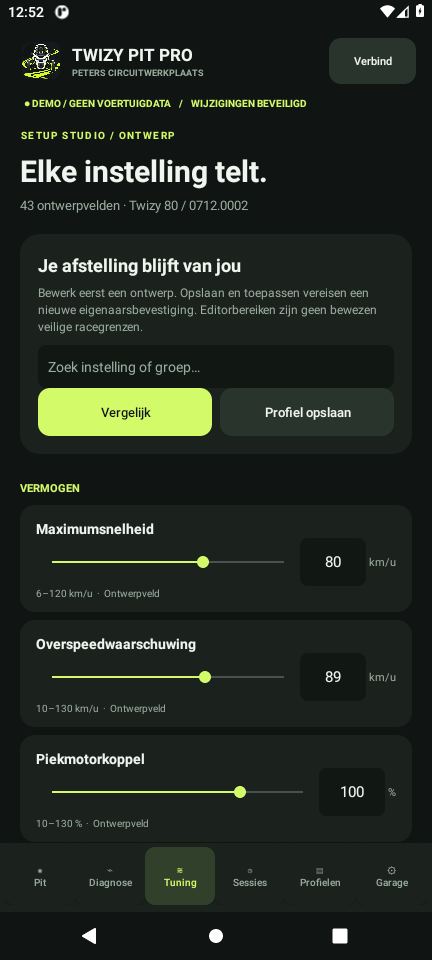
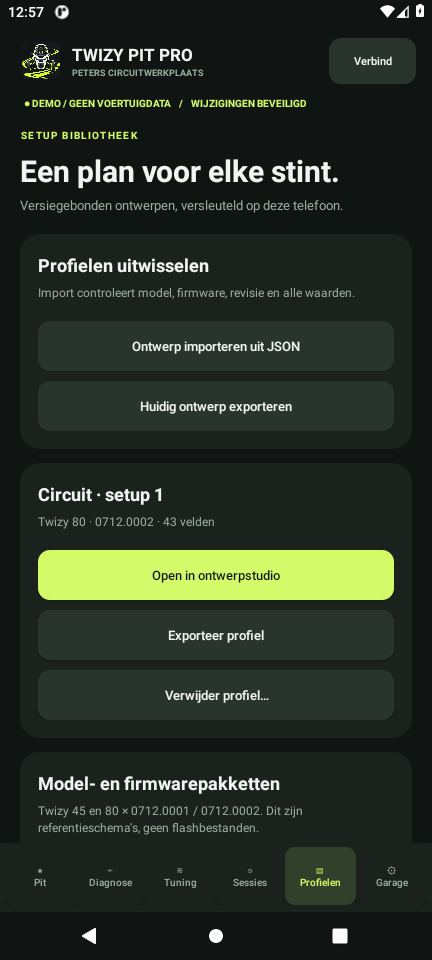

<p align="center"></p>

# Twizy Pit Pro

Een pitstudio voor Renault Twizy: een native Android-app en een Windows/laptop-GUI met diagnose, telemetrie, profielontwerp en toestelgoedkeuring op Android.

**Laptop 0.4.1-preview heeft een vLinker-schrijfroute met tijdelijke level-4-toegang, 75 uitgelezen beginwaarden, selectie per instelling, backup, read-back en controle na contactcyclus.** De software is offline getest. Een volledige tuningwijziging op een echte Twizy is nog niet gevalideerd. [Wijzigingen en gebruik](docs/STATUS-0.4.1.md).

**Android 0.3.1 en M5 kunnen nog niet zelfstandig tuning schrijven.** Android 0.3.1 corrigeert de CAN-weergave van accuspanning en N. De laptop leest nu ook de eerste tien Renault-clusterfoutslots; actieve meldingen blokkeren tuning. ECU-flashen en foutwissen ontbreken in de GUI.

[Android APK downloaden](https://github.com/rakkipe/TwizyPitPro/releases/tag/v0.4.1-preview) · [Android-handleiding](docs/ANDROID.md) · [Hardware](docs/HARDWARE.md) · [Validatie](docs/VALIDATIE.md)

<p align="center">
  
  
</p>

Nieuw in 0.3: **75 registers voor alle 43 ontwerpvelden**, een volledige registervergelijking in beide GUI's en uitgebreidere CAN-uitlezing. [Nieuwe vLinker-schrijfprocedure en beperkingen](docs/STATUS-0.4.md).

## Wat zit erin?

- Een zelfstandige, native Android-app voor **Android 11 of nieuwer**; geen WebView en geen laptop nodig voor de demo.
- Een donkere grafische pitstudio met dashboard, diagnose, 43 ontwerpvelden, registervergelijking en versiegebonden profielen.
- Laptop: een afzonderlijke vLinker-schrijfprocedure met beginsnapshot, bevestiging, read-back en expliciet herstel.
- Vier referentieschema's: **Twizy 45/80 × SEVCON 0712.0001/0712.0002**. Identiteit en revisie moeten passen; onbekende combinaties en 0712.0003+ blokkeren demo-toepassing.
- Een CANopen-leespad voor **vLinker FS via USB** of **M5StickC Plus2 + CAN Unit U085** met de meegeleverde PitBridge-firmware. Uitlezing van controlleridentiteit, firmware en beschikbare diagnosewaarden. De vLinker-leesverbinding is op hardware gebruikt; M5 en Android vereisen nog fysieke validatie.
- Profielen, sessies, handmatige rondemarkeringen en CSV-/JSON-export. Android heeft optionele GPS-registratie zolang de app op de voorgrond staat.
- Android: goedkeuring per opgeslagen wijziging met biometrie/toestelcode, Keystore en versleutelde opslag. De laptop bedien je zonder appwachtwoord; de wifi-viewer kan alleen lezen.
- Een eigen appicoon en een telefoonviewer voor het dashboard van de laptop.

Controllerherkenning bewijst niet welke reductiekast of mechanische uitvoering gemonteerd is. De simulator gebruikt fictieve identiteit en synthetische meetwaarden en voorspelt geen circuitprestaties. Versiepakketten zijn referentieschema's, geen gegenereerde ECU-firmware.

## Android installeren

1. Download `TwizyPitPro-0.3.1.apk` bij de [release](https://github.com/rakkipe/TwizyPitPro/releases/tag/v0.4.1-preview).
2. Open het bestand op je telefoon en geef die bestandsapp zo nodig toestemming om apps te installeren.
3. Start **Twizy Pit Pro**. De app opent in demo. Stel een eigen toestelcode of biometrie in om wijzigingen te kunnen bewaren.

De release bevat ook een SHA-256-bestand en het openbare ondertekeningsrapport. De officiële certificaatvingerafdruk staat in [de Android-handleiding](docs/ANDROID.md#apk-en-updates). Updates installeer je zelf; de privésleutel wordt niet gepubliceerd.

## Laptop starten

Benodigd: Windows, Python 3.12 of nieuwer en internet voor de eerste installatie. Download de broncode of clone deze repository. Open PowerShell in de projectmap:

```powershell
powershell -NoProfile -ExecutionPolicy Bypass -File .\Install.ps1
powershell -NoProfile -ExecutionPolicy Bypass -File .\Start.ps1 -LocalOnly
```

Open daarna `http://127.0.0.1:8765`. De laptop vraagt geen appwachtwoord. Wie toegang heeft tot je Windows-sessie kan de app bedienen. De installatie maakt een snelkoppeling **in de projectmap**; je kunt die naar je bureaublad kopiëren.

`Start.vbs` of `Start.ps1` zonder `-LocalOnly` maakt de telefoonviewer beschikbaar op het lokale netwerk. Gebruik daarvoor je eigen hotspot of vertrouwd wifi: deze viewer gebruikt HTTP met een tijdelijke toegangssleutel, zonder TLS. Firewallregels worden niet automatisch gewijzigd.

Wil je de APK via de laptopknop aanbieden, plaats dan het releasebestand in `releases/android/TwizyPitPro-0.3.1.apk`. APK's en persoonlijke gegevens zitten niet in de Git-broncode.

## Ontwikkelen en testen

De laptop gebruikt Python, standaardbibliotheek HTTP en `pyserial==3.5`. De Android-app gebruikt Java, Android SDK 35 en USB Serial for Android 3.10.0; de Windows-buildscripts werken zonder Gradle.

```powershell
# Na Install.ps1: de offline Python-tests
.\.venv\Scripts\python.exe -m unittest discover -s tests -q

# Android: bouwtools downloaden, ongetekend bouwen, 26 kerncontroles
.\.venv\Scripts\python.exe scripts\setup_android.py
.\android\Build.ps1 -Unsigned
.\.venv\Scripts\python.exe scripts\test_android.py

# Een eigen installabele APK ondertekenen
.\android\Initialize-AndroidSigning.ps1
.\android\Build.ps1
```

De ongetekende APK staat onder `android/build/aligned.apk`; de getekende onder `releases/android/`. Initialisatie maakt **jouw eigen** lokale sleutel. Daarmee kun je de officiële APK niet als update vervangen. Bewaar eigen sleutels buiten Git. De scripts downloaden bouwafhankelijkheden; de voor 0.2.0 gebruikte versies staan in [de bouwregistratie](docs/android-build-dependencies.json). Het setupscript kiest de nieuwste Java 21-release en kan bij een latere uitvoering andere bouwtools ophalen; een identieke binaire rebuild is niet gegarandeerd.

Voor laptop 0.4.1 zijn 123 Python-tests geslaagd. Voor Android 0.3.1 waren 26 kerncontroles geslaagd; de ondertekende APK en goedkeuringsflow zijn in een Android 11-emulator getest. Bekijk [de exacte controles en beperkingen](docs/VALIDATIE.md). GitHub Actions voert de Python-tests uit. De M5-build staat beschreven in [Hardware](docs/HARDWARE.md).

## Veiligheid, gegevens en bijdragen

Op Android beschermt toestelgoedkeuring de gebruiksinstallatie. Een openbare MIT-repository kan door anderen worden gekopieerd en gewijzigd; dat verandert jouw geïnstalleerde app niet. Iedereen met de toestelcode of geregistreerde biometrie kan op dat toestel goedkeuren. Deze release heeft geen onafhankelijke beveiligingsaudit gehad.

Lokale data, exports, wachtwoorden, signingmateriaal, bouwtools en test-APK's worden uitgesloten van Git. Handmatige CSV-/JSON-exports zijn leesbare bestanden. Deel geen ongefilterde voertuiglogs of sleutels in issues. Zie [SECURITY.md](SECURITY.md) en [CONTRIBUTING.md](CONTRIBUTING.md).

## Licentie en bronnen

[MIT](LICENSE), copyright 2026 rakkipe. Hergebruik en wijzigingen zijn toegestaan met behoud van de licentietekst. Onderdelen van derden behouden hun eigen notices; zie [THIRD_PARTY_NOTICES.md](THIRD_PARTY_NOTICES.md) en [bronnen en onderbouwing](docs/BRONNEN.md).

Een onafhankelijk project, zonder officiële band met Renault, Vgate, M5Stack of Open Vehicles.
